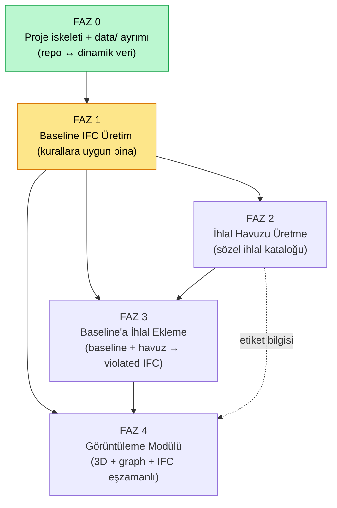
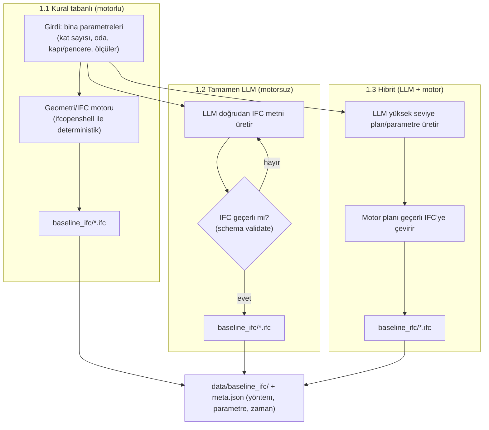
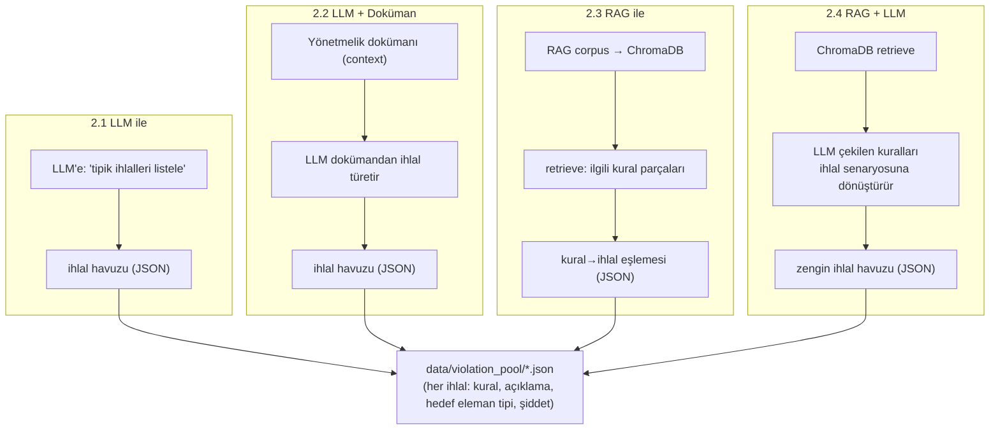
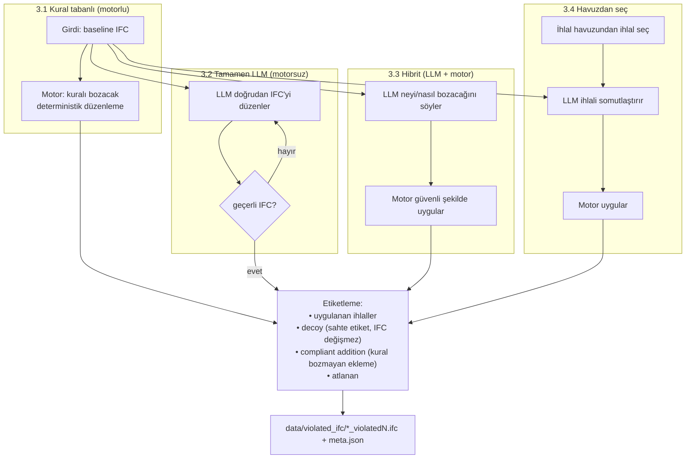
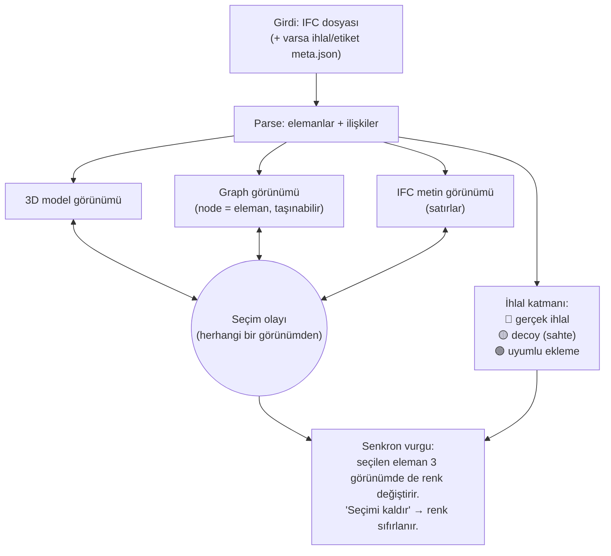

# Akış Diyagramı — IFC Üretimi (Manuel, Adım Adım)

Bu belge, lokalde **adım adım** ilerleyeceğimiz işin sıralı planıdır. Aşağıda
önce **genel akış**, sonra her modülün **alt akışı** var. Her kutu = ayrı bir
adım. Bir adımı bitirip onaylamadan diğerine geçmiyoruz.

> Kapsam (şimdilik SADECE bunlar):
> 1. Baseline IFC üretimi
> 2. İhlal havuzu üretme
> 3. Baseline'a ihlal ekleme
> 4. Görüntüleme modülü
>
> GAT eğitimi, performans analizi vb. **bu turda yok.**
>
> **Çalışma tarzı:** Tek bir arayüz YOK. Her adımı **Jupyter notebook**'ta tek tek
> yapıp gösteriyoruz (`notebooks/`). Motorlar `src/` altında, notebook'lar onları
> import edip çalıştırır.
>
> **Sıra notu:** Faz 1.1 motoru (baseline IFC) hazır olunca, viewer'a girdi
> oluştuğu için **Faz 4 (görselleştirme) öne alındı** ve yapıldı. Kalan üretim
> yöntemleri sırayla devam edecek.

---

## 0. Genel Akış (bağımlılık sırası)

`öncelikle ifc üretimi yapacağız` dediğin için sıralama, bağımlılıklara göre
şöyle: önce ortada bir bina (baseline) olmalı; sonra ihlal havuzu; sonra
ihlalleri binaya enjekte; en sonda hepsini görselleştiren viewer.

**Durum:** FAZ 0 bitti (bu commit). Sıradaki: **FAZ 1 — Baseline IFC Üretimi.**

---

## FAZ 1 — Baseline IFC Üretimi

Amaç: kurallara uygun, ihlalsiz bir bina IFC'si üretmek. 3 yöntemi sırayla
yapıp karşılaştıracağız.

Sıra: **1.1 → 1.2 → 1.3.** Her biri ayrı adım, ayrı onay.

---

## FAZ 2 — İhlal Havuzu Üretme

Amaç: yönetmelik/kural ihlallerinin **sözel** kataloğu (henüz IFC değişmez).
4 yöntem:

Sıra: **2.1 → 2.2 → 2.3 → 2.4.**

---

## FAZ 3 — Baseline'a İhlal Ekleme

Amaç: baseline IFC + ihlal → `violated` IFC. Hangi ihlalin nereye uygulandığı
**etiket** olarak saklanır (viewer ve sonraki ML için ground-truth).

Sıra: **3.1 → 3.2 → 3.3 → 3.4.**

---

## FAZ 4 — Görüntüleme Modülü

Girdi: bir IFC dosyası. Çıktı: 3D model + graph + IFC metni, **üçü senkron**.

**Etkileşim kuralı:** graph'ta bir node'a tıkla → o node, 3D'deki eleman ve
IFC'deki ilgili satırlar renk değiştirir. Başka node → güncellenir. "Seçimi
kaldır" → sıfırlanır. Aynısı 3D'den ve IFC satırından tıklayınca da çalışır
(çift yönlü).

---

## İlerleme Takibi

| Faz | Adım | Durum | Notebook / Modül |
|-----|------|-------|------------------|
| 0 | Proje iskeleti + `data/` ayrımı | ✅ Bitti | — |
| 1 | 1.1 Kural tabanlı baseline (metre, kurallara uygun) | ✅ Bitti | `src/ifc_gen/baseline/` |
| 4 | Görüntüleme modülü (3D+graph+IFC senkron, detay paneli, tam ekran) | ✅ Bitti | `notebooks/faz4_gorsellestirme.ipynb` |
| 4 | İhlal/decoy/compliant renk katmanı (🔴/🟡/🟢) | ✅ Bitti | `view(..., labels=meta.json)` |
| — | Kural seti (R1/R2/R3) + tespit | ✅ Bitti | `docs/kural_seti.md`, `src/ifc_gen/inject/rules.py` |
| 3 | 3.1 Kural tabanlı ihlal ekleme | ✅ Bitti | `notebooks/faz3_1_kural_tabanli_ihlal.ipynb` |
| 1 | 1.2 Tamamen LLM baseline | ⬜ Sırada | — |
| 1 | 1.3 Hibrit baseline | ⬜ | — |
| 2 | 2.1 LLM ihlal havuzu | ⬜ | — |
| 2 | 2.2 LLM+doküman ihlal havuzu | ⬜ | — |
| 2 | 2.3 RAG ihlal havuzu | ⬜ | — |
| 2 | 2.4 RAG+LLM ihlal havuzu | ⬜ | — |
| 3 | 3.2 Tamamen LLM ihlal ekleme | ⬜ | — |
| 3 | 3.3 Hibrit ihlal ekleme | ⬜ | — |
| 3 | 3.4 Havuzdan seç → LLM → motor | ⬜ | — |
| — | R4 (kullanıcı kuralı) — `docs/kural_seti.md` placeholder | ⬜ | — |

> Her adım bittiğinde bu tabloyu güncelleyip commit/push edeceğiz.
